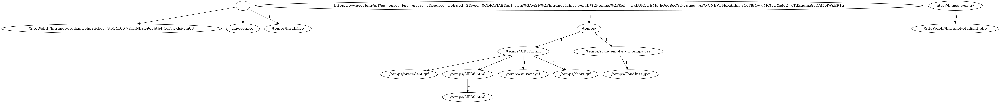

# Analog - Analyseur de Logs Apache

**Analog** est un outil en ligne de commande développé en C++ conçu pour analyser les fichiers journaux (logs) des serveurs web Apache. Il permet d'extraire des statistiques de consultation et de visualiser le parcours des utilisateurs sous forme de graphe.

## Fonctionnalités

L'application répond aux besoins d'analyse suivants :
* **Statistiques par défaut** : Affiche la liste des 10 documents les plus consultés par ordre décroissant de popularité.
* **Génération de graphe (-g)** : Produit un fichier au format GraphViz (`.dot`) où chaque document est un nœud et chaque arc indique le nombre de parcours entre deux pages.
* **Filtrage des ressources (-e)** : Permet d'exclure tous les documents ayant une extension de type image, CSS ou Javascript.
* **Filtrage horaire (-t)** : Limite l'analyse aux requêtes effectuées dans un créneau horaire spécifique `[heure, heure+1[`.

## Configuration
Pour configurer l'analyseur de logs, il faut modifier le fichier config.txt. Ce fichier contient :
- l'url utilisée comme base, considérée comme locale (par défaut : http://intranet-if.insa-lyon.fr)
- une liste des extensions des fichiers non pris en compte avec la commande -e (par défaut : les images, documents CSS et Javascript)

*Exemple :* pour exclure l'extension `.webp`, ajoutez simplement `"webp"` à la liste existante dans le fichier.

## Utilisation

Le programme peut-être utilisé en exécutant la commande make puis la commande suivante :

```bash
./analog [-g nomfichier.dot] [-e] [-t heure] nomfichier.log
```

## Compilation

Le projet utilise un **Makefile** pour automatiser la gestion des dépendances et la compilation avec les drapeaux d'optimisation nécessaires.

```bash
make
```

Pour nettoyer les fichiers objets et l'exécutable :
```bash
make clean
```

## Génération du graphe à partir du fichier .dot avec Graphviz

Une fois que votre fichier `.dot` est prêt, la transformation en image se fait depuis votre terminal. C'est l'outil `dot` qui se charge de calculer la disposition des nœuds et de dessiner les flèches pour vous.

Utilisez la commande suivante dans votre terminal :

```bash
dot -Tpng mon_graphe.dot -o graphe.png
```

### Détails de la commande :

* **`-Tpng`** : Définit le format de sortie. Ici, nous générons un fichier **PNG**, mais vous pourriez utiliser `-Tsvg` ou `-Tpdf` selon vos besoins.
* **`mon_graphe.dot`** : C'est votre fichier source, celui qui contient la description textuelle de votre graphe.
* **`-o graphe.png`** : L'option `-o` (pour *output*) spécifie le nom du fichier image qui sera créé.

> Si votre graphe est très grand, essayez le format **SVG** (`-Tsvg`). Contrairement au PNG, vous pourrez zoomer sans perte de qualité.

### Aperçu du résultat :
[](out.png)

## Gestion des Erreurs

Le programme gère les cas d'utilisation invalides et informe l'utilisateur via `stderr` :

* **Fichier introuvable** : "ERREUR : Le fichier [nom] n'a pas pu être ouvert !".
* **Heure invalide** : "Erreur : L'heure doit être comprise entre 0 et 23.".
* **Argument manquant** : Affiche l'aide à l'utilisation si aucun fichier de log n'est spécifié.


## Procédure de Test

Le projet intègre un framework de test pour valider les spécifications. Pour lancer la suite de tests automatisée, utilisez les commandes suivantes depuis la racine du projet :

```bash
cd ./tests/
./mktest.sh
```


